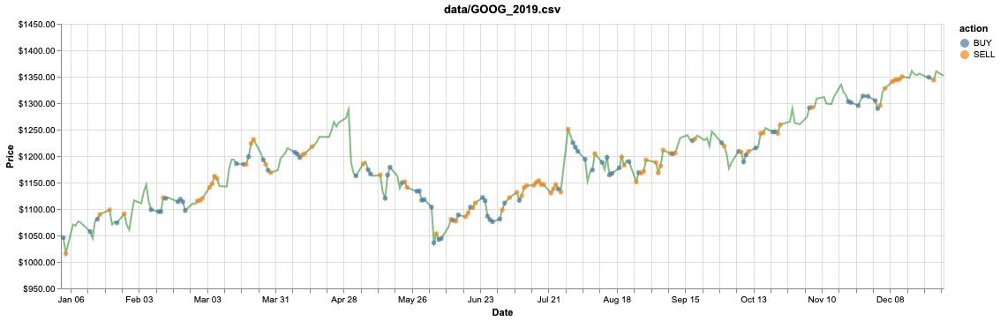

# 🌃 NETRUNNER TRADING PROTOCOL v2.077 🌃

```
 ██████╗██╗   ██╗██████╗ ███████╗██████╗ ████████╗██████╗  █████╗ ██████╗ ███████╗██████╗ 
██╔════╝╚██╗ ██╔╝██╔══██╗██╔════╝██╔══██╗╚══██╔══╝██╔══██╗██╔══██╗██╔══██╗██╔════╝██╔══██╗
██║      ╚████╔╝ ██████╔╝█████╗  ██████╔╝   ██║   ██████╔╝███████║██║  ██║█████╗  ██████╔╝
██║       ╚██╔╝  ██╔══██╗██╔══╝  ██╔══██╗   ██║   ██╔══██╗██╔══██║██║  ██║██╔══╝  ██╔══██╗
╚██████╗   ██║   ██████╔╝███████╗██║  ██║   ██║   ██║  ██║██║  ██║██████╔╝███████╗██║  ██║
 ╚═════╝   ╚═╝   ╚═════╝ ╚══════╝╚═╝  ╚═╝   ╚═╝   ╚═╝  ╚═╝╚═╝  ╚═╝╚═════╝ ╚══════╝╚═╝  ╚═╝
                    [ NIGHT CITY MARKET EXPLOITATION SYSTEM ]
```

> *"In 2077, what makes someone a successful trader? Getting rich."*
> — V, probably

[](https://github.com)
[](https://github.com)
[](https://github.com)

---

## 🔮 OVERVIEW | PROGRAM BRIEFING

**Choom**, welcome to the most preem stock trading ICE-breaker this side of Night City. This neural network runs hotter than a Militech shard, trained using **Deep Reinforcement Learning** (Deep Q-Learning) to hack the corpo markets and extract maximum eddies.

Implementation is delta-grade — clean, minimal, and optimized for those chooms who want to understand the tech behind the chrome.

---

## 💀 INTRODUCTION | JACKING IN

In the dark future of automated trading, **Reinforcement Learning** is the closest thing to true machine consciousness. These algorithms learn like street samurai — through trial, error, and a whole lot of flatlined trades.

The beauty? This technique adapts to any market situation that can be described as a **Markovian process** — which in corpo-speak means: *"The future depends only on the present, not the past."*

> 💡 **NetRunner Tip:** Traditional supervised learning is like following a corpo playbook. RL is like being a solo — you learn what works through experience on the streets.

---

## ⚡ APPROACH | COMBAT ALGORITHMS

This daemon utilizes **Model-free Reinforcement Learning** via **Deep Q-Learning** — think of it as installing a Sandevistan for your trading decisions.

**The Loop:**
```
[JACK IN] → Observe market state → Execute action (BUY/SELL/HOLD) → 
Receive reward signal → Update neural weights → [REPEAT]
```

### 🔧 INSTALLED CYBERWARE (Implemented Features)

- [x] 🧠 **Vanilla DQN** — Base neural implant
- [x] 🎯 **DQN with Fixed Target Distribution** — Stabilized targeting system  
- [x] 🔄 **Double DQN** — Dual-core processing for better value estimation
- [x] ⚡ **Batch Prediction** — Overclocked training speed
- [ ] 📊 **Prioritized Experience Replay** — Memory optimization (coming soon)
- [ ] 🏗️ **Dueling Network Architectures** — Advanced combat protocols (coming soon)

---

## 🔧 SYSTEM REQUIREMENTS | CYBERWARE SPECS

```
╔══════════════════════════════════════════════════╗
║  MINIMUM REQUIREMENTS FOR NEURAL LINK            ║
╠══════════════════════════════════════════════════╣
║  ► Python 3.9+ (Neural Interface)                ║
║  ► TensorFlow 2.16+ (Cortex Processor)           ║
║  ► Keras 3.x (Synaptic Framework)                ║
╚══════════════════════════════════════════════════╝
```

---

## 📊 RESULTS | EDDIES EXTRACTED

**Target:** `GOOG` corpo stock (2010-17 training data)  
**Mission Status:** ✅ **COMPLETE**  
**Profit Extracted:** `$1,141.45` (2019 test) | `$863.41` (2018 validation)



> *"That's a lot of eddies, choom."*

Check out the [DataKrash Visualization Notebook](./visualize.ipynb) for detailed analytics of your runs.

---

## ⚠️ KNOWN LIMITATIONS | SYSTEM BUGS

| Issue | Description |
|-------|-------------|
| 🎯 **Single-Stock Mode** | Agent trades one share at a time — keeps the neural load manageable, choom |
| 📈 **Normalized Vectors** | N-day window uses sigmoid normalization [0,1] — standard Arasaka protocols |
| 🖥️ **CPU Training** | Sequential nature means CPU outperforms GPU — no Kiroshi optics needed here |

---

## 💾 DATA SOURCES | CORPO INTEL

Download market data from [Yahoo! Finance](https://ca.finance.yahoo.com/) or use the included datasets in `data/` directory — pre-extracted from Arasaka servers. 

---

## 🚀 GETTING STARTED | INITIALIZATION SEQUENCE

### STEP 1: Install Neural Drivers

```bash
# Initialize cyberware dependencies
pip3 install -r requirements.txt
```

### STEP 2: Begin Training Protocol

```bash
# Jack into the training matrix
python3 train.py data/GOOG.csv data/GOOG_2018.csv --strategy t-dqn
```

### STEP 3: Deploy Trading Daemon

```bash
# Unleash the trading ICE-breaker
python3 eval.py data/GOOG_2019.csv --model-name model_debug_10.keras --debug
```

```
╔════════════════════════════════════════════════════════════╗
║  > SYSTEM INITIALIZED                                      ║
║  > NEURAL LINK: ESTABLISHED                                ║
║  > MARKET CONNECTION: ONLINE                               ║
║  > STATUS: READY TO EXTRACT EDDIES                         ║
╚════════════════════════════════════════════════════════════╝
```

---

## 💿 MODEL FORMAT | DATA SHARD SPECS

Models are saved in **Keras 3 `.keras` format** — the new corpo standard. Legacy TensorFlow 1.x shards are incompatible. If you've got old chrome, you'll need to retrain from scratch.

---

## 🙏 CREDITS | FIXERS & CHOOMS

**Props to these legendary NetRunners:**

- [@keon](https://github.com/keon) — Original [deep-q-learning](https://github.com/keon/deep-q-learning) architect
- [@edwardhdlu](https://github.com/edwardhdlu) — [q-trader](https://github.com/edwardhdlu/q-trader) pioneer

---

## 📚 REFERENCES | ARASAKA DATABASE

**Required Reading for Aspiring NetRunners:**

- 📖 [Playing Atari with Deep Reinforcement Learning](https://arxiv.org/abs/1312.5602) — *The OG shard*
- 📖 [Human Level Control Through Deep Reinforcement Learning](https://deepmind.com/research/publications/human-level-control-through-deep-reinforcement-learning/) — *DeepMind's magnum opus*
- 📖 [Deep RL with Double Q-Learning](https://arxiv.org/abs/1509.06461) — *Dual-core optimization*
- 📖 [Prioritized Experience Replay](https://arxiv.org/abs/1511.05952) — *Memory enhancement protocols*
- 📖 [Dueling Network Architectures](https://arxiv.org/abs/1511.06581) — *Advanced combat systems*

---

<div align="center">

```
    ╔═══════════════════════════════════════════════════════════╗
    ║                                                           ║
    ║   "The street finds its own uses for things."             ║
    ║                        — William Gibson                   ║
    ║                                                           ║
    ║   Wake up, Samurai. We have markets to burn. 🔥           ║
    ║                                                           ║
    ╚═══════════════════════════════════════════════════════════╝
```

**Made with 💜 in Night City | 2077**

</div>